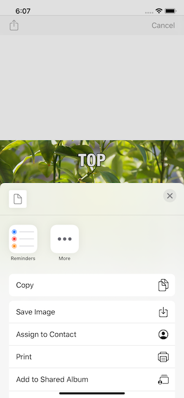

# Meme-Me-iOS
Meme Me App for Udacity iOS Nano-Degree Project

## Screenshots
| Home Screen| Image Picker | Create Meme | Share Meme |
| ----------------- |  ----------------- | ----------------- | ----------------- |
|  |   |  |  |

| List View | Grid View |
| ----------------- |  ----------------- |
|  |   |

## Frameworks Used
UIKit

## Instructions

1. Select Add icon in upper right
2. Select image for meme by tapping camera (to take picture) or album (to select existing picture)
3. Tap on TOP text to type text on top of image
4. Tap on BOTTOM text to type text on bottom of image
5. Click share icon in upper left to share or save the image
# Meme-Me-iOS
