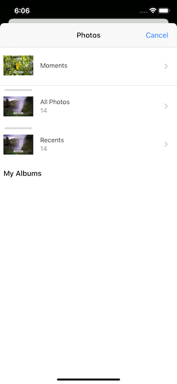

# Meme-Me-iOS
The Meme-Me app was created to specification for my final project in the UIKit Fundamentals course as a part of my iOS Developer Nanodegree from Udacity. Meme-Me is an app that allows you to take a picture (or select one from your album) and add text to top and bottom of the image to create a Meme. Once you have created your Meme you can save it to your Album or send it to a friend.

## Screenshots
| Home Screen| Image Picker | Create Meme | Share Meme | List View | Grid View |
| ----------------- |  ----------------- | ----------------- | ----------------- | ----------------- |  ----------------- |
|  |   |  |  |  |   |

## Frameworks Used
- Foundation
- UIKit

## Instructions

### Home Screen:
- Tap the + button in the upper right to take you to the [Create Meme](https://github.com/JustinKumpePortfolio/Meme-Me-iOS#create-meme-screen) Screen
- Tap List at the bottom to take you to the [List View](https://github.com/JustinKumpePortfolio/Meme-Me-iOS#list-view-screen) screen to view saved Memes in a list format
- Tap Grid at the bottom to take you to the [Grid View](https://github.com/JustinKumpePortfolio/Meme-Me-iOS#grid-view-screen) screen to view saved Memes in a grid format

### Create Meme Screen:
- Tap the camera icon at the bottom to take a photo with your camera
- Tap the Album button at the bottom to select a photo from your album in the [Image Picker](https://github.com/JustinKumpePortfolio/Meme-Me-iOS#image-picker-screen) screen
- Tap the Top/Bottom text to add text to the Top or Bottom of your image
- Once you have created your Meme click the Share icon in the upper right to take you to the [Share Meme](https://github.com/JustinKumpePortfolio/Meme-Me-iOS#share-meme-screen) screen

### Image Picker Screen:
- Select a photo from your photo album to use for creating a meme

### Share Meme Screen:
- Select an option from the screen to save the image or share it with a friend

### List View Screen:
- View a list of Memes you have created
- Tapping on the image from the list will show a larger version of the image
- Swipe left on the image from list to delete from saved images

### Grid View Screen:
- View a list of Memes you have created
- Tapping on the image from the list will show a larger version of the image

